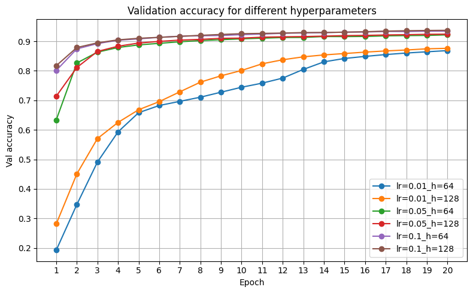
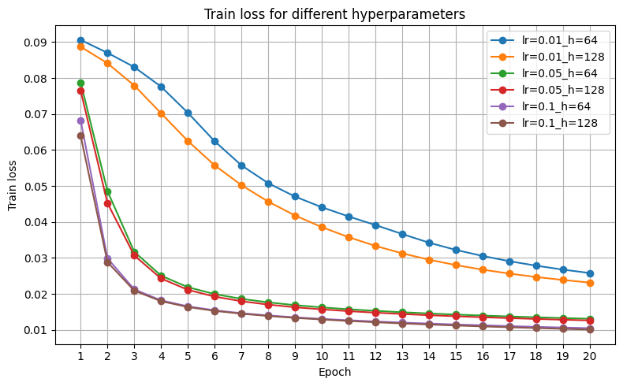
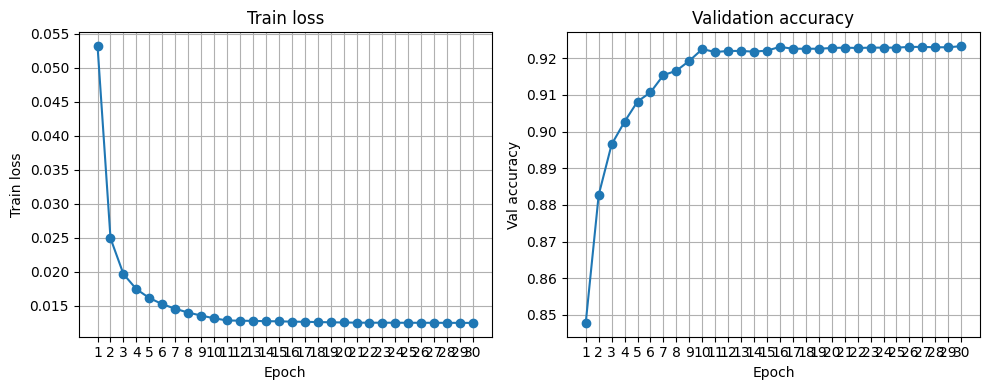

# dat-mag-iad-lab-2

## Запуск
```python
python -m main
```

## Тестирование корректности слоев и лосса

Для каждого компонента реализованы тесты:

- **Linear**: сравниваются `forward` и градиенты `dX`, `dW`, `db` с `nn.Linear`  
- **ReLU**: проверяется, что `forward` и производная совпадают с `nn.ReLU`  
- **Softmax**: сравниваются выходы и градиенты с `nn.Softmax(dim=1)`  
- **MSELoss**: проверяется совпадение значения функции потерь и градиента с `nn.MSELoss(reduction="mean")`

Запуск тестов (из корня проекта):
```python
pytest -s tests/test_linear.py
```
```python
pytest -s tests/test_relu.py
```
```python
pytest -s tests/test_softmax.py
```
```python
pytest -s tests/test_mse.py
```

## Эксперименты с гиперпараметрами

Для оценки влияния гиперпараметров проведены эксперименты с:

- learning rate: `0.01`, `0.05`, `0.1`
- размер скрытого слоя: `hidden_size = 64` и `128`
- фиксированным числом эпох: `20`
- batch size: `64`

### Валидационная точность



График показывает, что:

- Увеличение **learning rate** с `0.01` до `0.1` заметно ускоряет обучение и приводит к более высокой итоговой точности при тех же 20 эпохах.
- Увеличение **hidden_size** с `64` до `128` даёт стабильный прирост точности на всех lr.
- Лучшие эксперименты (`lr = 0.1`, `hidden_size = 128`) выходят на валидационную точность около **0.92–0.93** уже к 8–10‑й эпохе, после чего кривая выходит на плато.

Такое поведение типично для MLP на MNIST: без свёрток и с MSELoss вместо кросс‑энтропии потолок качества оказывается ниже, чем у современных сверточных моделей

### Train loss



Из графика видно, что:

- При `lr = 0.05` и `0.1` train loss очень быстро падает и стабилизируется на уровне ~0.01–0.015.
- У меньшего шага (`lr = 0.01`) убывание loss более плавное, и к 20‑й эпохе модель заметно недообучена по сравнению с более агрессивными lr.
- Модель с `hidden_size = 128` достигает меньшего loss, чем с `64`, что согласуется с более высокой валидационной точностью.

## Финальный запуск с lr-schedule

Помимо сравнения фиксированных гиперпараметров, был проведен отдельный финальный запуск с расписанием learning rate:
- `hidden_size = 256`
- `batch_size = 64`
- `num_epochs = 30`
- lr‑schedule по эпохам:
  - первые 1/3 эпох: `lr = 0.1`
  - вторые 1/3 эпох: `lr = 0.01`
  - последние 1/3 эпох: `lr = 0.001`

### Кривые обучения



На графиках слева показан train loss, справа - validation accuracy для этого эксперимента:

- **Train loss** резко падает с ≈0.053 до ≈0.013 уже за первые 5–7 эпох, после чего выходит на плато и медленно убывает к ≈0.012  
- **Validation accuracy** стартует около 0.84, быстро растёт до ≈0.92 к 8–10‑й эпохе и затем стабилизируется на этом уровне до конца обучения
